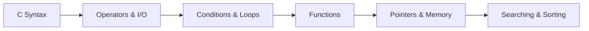

<div align="center">

# ⚙️ C Programming Lab

### Core C Fundamentals, Algorithms, Pointers, Functions & Memory Practice

**C Programming Lab** is a structured collection of small C programs built for learning, revision, and hands-on problem solving. The exercises move from operators and console I/O to functions, searching and sorting, parameter passing, and dynamic memory concepts.

<p align="center">
  
  
  
</p>

</div>

---

## 📚 Coverage

| Area | Examples |
|---|---|
| ➕ Operators & Expressions | Assignment and conditional operators |
| ⌨️ Input / Output | Character input, numeric calculations and formatted output |
| 🔁 Control Flow | Loops and conditional programs |
| 🧩 Functions | Call by value and reference-style pointer usage |
| 🔎 Searching | Binary search exercises |
| 🔃 Sorting | Bubble sort and related algorithm practice |
| 🧠 Memory | Dynamic memory allocation exercises |

## 🧭 Learning Path



## 🚀 Compile & Run

```bash
git clone https://github.com/shreeharsh-patil/C-Programming.git
cd C-Programming
gcc bubble_sort.c -o bubble_sort
./bubble_sort
```

On Windows PowerShell:

```powershell
gcc bubble_sort.c -o bubble_sort.exe
.\bubble_sort.exe
```

## 📁 Repository Snapshot

```text
C-Programming/
├─ assignment_operators.c
├─ binary_search.c
├─ bubble_sort.c
├─ call_by_reference.c
├─ call_by_value.c
├─ char_input_output.c
├─ conditional_operator.c
├─ dynamic_memory.c
└─ ...more focused C exercises
```

> [!TIP]
> Compile files with warnings enabled while practicing: `gcc -Wall -Wextra file.c -o program`.

## 🎯 Purpose

The repository is designed as a practical C reference for classroom labs, exam revision, algorithm practice, and strengthening low-level programming fundamentals.

## 👤 Project Author

Developed and maintained by **Shreeharsh Patil**.

- **Email:** shreeharsh.dev@gmail.com
- **GitHub:** [github.com/shreeharsh-patil](https://github.com/shreeharsh-patil)
